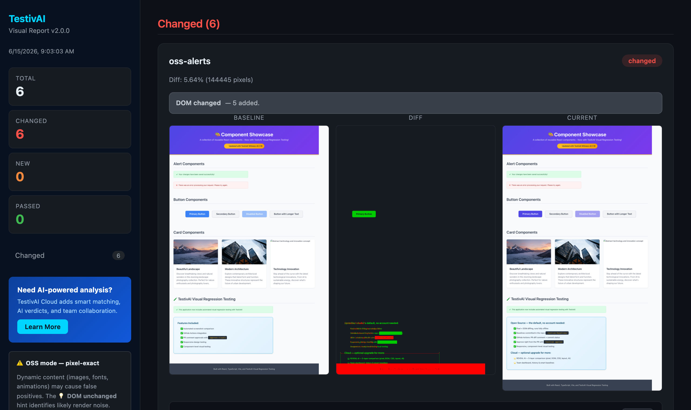

# TestivAI Open Source

[](https://www.npmjs.com/package/@testivai/common)
[](https://www.npmjs.com/package/@testivai/witness)
[](https://www.npmjs.com/package/@testivai/witness-playwright)
[](https://www.npmjs.com/package/@testivai/witness-webdriverio)
[](./LICENSE)

**Local-first visual regression testing SDKs for modern web applications.**

This is the public, open-source home for the TestivAI SDKs. It contains everything you need to capture, diff, and report visual regressions **fully locally** — with optional cloud upgrade via the TestivAI hosted service.

> 👀 **[See a live report →](https://www.budisugianto.com/testivai-demo-app/)** — a real TestivAI OSS report rendered in your browser, straight from CI. No install, no signup.

[](https://www.budisugianto.com/testivai-demo-app/)

## Why TestivAI?

Pixel-only visual testing drowns you in false positives — a font re-hint or an anti-aliasing shift across machines lights up as a "change," and you spend your time re-approving noise.

**TestivAI pairs every screenshot with a snapshot of the page DOM.** When pixels differ but the DOM is structurally identical, the report flags the diff as **likely render noise** instead of crying wolf. When the DOM actually changed, you see exactly what (`2 added, 1 removed`). That single signal is the difference between a flaky test wall and a report you trust.

- 🆓 **Fully local, no account** — captures, diffs, and a self-contained HTML report all stay on your machine.
- 🧠 **DOM-aware noise hint** — separates real changes from render jitter (see the banners in the report above).
- 🎭 **Auditable masks & region-level diffs** — exclude dynamic areas (selectors or coordinates) with the masked region hatched in the diff, and get "3 changed regions" with bounding boxes instead of a raw pixel percentage.
- 🔌 **First-class adapters** — Playwright (TS/JS **and Python**, Java experimental) and WebdriverIO, using each framework's native APIs; every language shares one set of baselines and one report.
- 🤖 **PR-native workflow** — a GitHub Action posts the diff and approves baselines from a `/testivai approve` comment.
- ☁️ **Optional cloud upgrade** — opt into [the hosted service](https://testiv.ai) for AI analysis, history, and team approvals. Never required.

## Eyes for your coding agent

If an AI agent (Claude Code, Cursor, Copilot, …) writes your UI code, someone still has to check what the UI *looks like* — and it shouldn't be you, one screenshot at a time. TestivAI is built to be that check:

- **No account, no API key, no network** — an agent can run it inside any sandbox without you provisioning secrets.
- **Machine-readable output** — every run writes `visual-report/results.json` (a [semver-governed schema](./docs/how-it-works.md)) with per-snapshot diff percentages and DOM change summaries, so an agent can read the result and self-correct.
- **Noise-aware verdicts** — the DOM hint tells the agent whether a pixel diff is *likely render noise* or a *real structural change* (`2 added, 1 removed`), so it doesn't chase anti-aliasing ghosts.
- **Human approval stays in the PR** — the agent iterates locally; you approve baselines with one `/testivai approve` comment.

Paste this into your project's `AGENTS.md` / `CLAUDE.md` to wire it up (full guide with MCP setup, a real agent transcript, and the approval rule: [docs/guides/ai-agents.md](./docs/guides/ai-agents.md)):

```markdown
## Visual verification
After changing any UI code, run `npx playwright test` (TestivAI captures
screenshots automatically), then read `visual-report/results.json`.
- `status: "changed"` with `dom.changed: true` → describe the DOM summary and
  ask whether the change is intended before approving.
- `status: "changed"` with `dom.noiseHint: true` → likely render noise; mention
  it but don't block.
- Never run `testivai approve` yourself — baseline approval is a human decision.
```

## Packages

Live versions are shown by the badges at the top of this README.

| Package | Description |
|---|---|
| [`@testivai/common`](./packages/common) | Shared utilities (config loading, API client, auth, compression) |
| [`@testivai/witness`](./packages/witness) | Core SDK: CLI, local diffing, baselines, HTML report generator |
| [`@testivai/witness-playwright`](./packages/playwright) | Playwright reporter/adapter built on top of `@testivai/witness` |
| [`@testivai/witness-webdriverio`](./packages/webdriverio) | WebdriverIO service + capture function (local mode) |
| [`@testivai/witness-selenium`](./packages/selenium) | Selenium WebDriver capture adapter (Python/Java Selenium live in `python/` and `java/`) |
| [`@testivai/mcp`](./packages/mcp) | MCP server — visual results + diff images for AI coding agents |
| [`testivai` (PyPI)](./python) | Python adapter for playwright-python + pytest plugin — same baselines & report |
| [`ai.testiv:testivai`](./java) | Java adapter for playwright-java + JUnit 5 extension (experimental) |

Plus:
- [`action/`](./action) — GitHub Action for PR-based visual approvals
- [`examples/`](./examples) — minimal real-world example projects
- [`docs/`](./docs) — public documentation
- [`e2e/`](./e2e) — OSS smoke E2E test suite

## No test suite? One command.

AI-built and vibe-coded apps (Lovable, Bolt, v0, ...) usually ship with zero
tests. You still get the full safety net:

```bash
npx testivai witness http://localhost:3000
```

TestivAI launches a headless Chrome, discovers your pages (or takes
`--pages "/,/pricing"`), and captures each one — baselines, diffs, noise
hints, HTML report, and PR approvals all work exactly as below, no test
framework required. See the [vibe-coded apps guide](./docs/guides/vibe-coded-apps.md).

## Quick Start (Playwright, Local Mode)

```bash
# 1. Install
npm install -D @testivai/witness-playwright @playwright/test
npx playwright install chromium
```

```jsonc
// 2. Tell TestivAI to run in local mode (no API key, no upload)
// File: .testivai/config.json
{
  "mode": "local",
  "threshold": 0.1,            // per-pixel color sensitivity (0-1)
  "maxDiffPercent": 0,         // pass diffs at or below this % (your tolerance dial)
  "noiseAutoPass": false,      // true: DOM-identical diffs within noiseMaxDiffPercent pass
  "stabilize": true,           // freeze animations, hide caret, wait for fonts
  "ignoreSelectors": [],       // e.g. [".live-chat", "[data-testid=clock]"]
  "reportDir": "visual-report",
  "autoOpen": false
}
```

```ts
// 3. Wire the reporter — playwright.config.ts
import { defineConfig } from '@playwright/test';

export default defineConfig({
  reporter: [
    ['list'],
    ['@testivai/witness-playwright/reporter'],
  ],
});
```

```ts
// 4. Add a capture call — tests/example.spec.ts
import { test } from '@playwright/test';
import { testivai } from '@testivai/witness-playwright';

test('homepage looks correct', async ({ page }, testInfo) => {
  await page.goto('http://localhost:3000');
  await testivai.witness(page, testInfo, 'homepage');
});
```

```bash
# 5. Run
npx playwright test
```

**First run:** baselines are written to `.testivai/baselines/`.
**Later runs:** screenshots are diffed and a self-contained HTML report is written to `./visual-report/`.

## What you get out of the box (free, no account)

- ✅ Full-page screenshot capture via Playwright
- ✅ **Stabilized captures by default** — animations/transitions frozen, caret hidden, web fonts awaited (the top causes of flaky visual tests, neutralized before every screenshot)
- ✅ Local pixel diff with configurable threshold
- ✅ **Tunable pass criteria** — `maxDiffPercent` / `maxDiffPixels` tolerances, plus opt-in `noiseAutoPass` so DOM-identical render noise stops demanding review
- ✅ `ignoreSelectors` for dynamic content (both adapters, global or per-snapshot)
- ✅ Self-contained HTML report (`visual-report/index.html`)
- ✅ Machine-readable results (`visual-report/results.json`)
- ✅ Committed baselines under `.testivai/baselines/` (just `git add` them)

## Optional: Cloud Mode

Set `TESTIVAI_API_KEY` in your shell to opt into the [hosted TestivAI service](https://testiv.ai), which adds:
- AI-powered change analysis (REVEAL Engine™)
- Hosted dashboard, team workflow, PR-based approvals
- Smart Baseline approval flow

Cloud mode is **opt-in**. The SDKs work entirely locally without it.

## CI Integration (GitHub Actions)

Copy this single workflow file into your repository. It handles both running the visual regression tests **and** processing `/testivai approve` commands from PR comments — no extra secrets, no external services required.

```yaml
# .github/workflows/testivai-oss.yml
name: TestivAI OSS

on:
  pull_request:
    branches: [main]
  issue_comment:
    types: [created]        # listens for /testivai approve commands

permissions:
  contents: write           # approve action commits updated baselines to the branch
  pull-requests: write      # post PR diff comment
  statuses: write           # set pass/fail indicator on the PR

jobs:

  # Runs on every PR — captures screenshots, diffs against baselines, posts report
  visual-regression:
    name: Visual Regression (OSS)
    if: github.event_name == 'pull_request'
    runs-on: ubuntu-latest
    timeout-minutes: 15
    steps:
      - uses: actions/checkout@v4
      - uses: actions/setup-node@v4
        with: { node-version: '20', cache: 'npm' }
      - run: npm ci
      - run: npx playwright install chromium --with-deps
      - run: npm run build
      - run: npm run test:oss          # runs playwright.oss.config.ts

      - name: Post results + upload report
        uses: mcbuddy/testivai-oss@v1
        if: always()
        with:
          github-token: ${{ secrets.GITHUB_TOKEN }}
          report-dir: visual-report   # where @testivai/witness writes results.json

  # Runs when a collaborator comments /testivai approve on the PR
  approve-baselines:
    name: Approve Baselines
    if: |
      github.event_name == 'issue_comment' &&
      github.event.issue.pull_request != null &&
      startsWith(github.event.comment.body, '/testivai')
    runs-on: ubuntu-latest
    timeout-minutes: 10
    steps:
      - uses: mcbuddy/testivai-oss/approve@v1
        with:
          github-token: ${{ secrets.GITHUB_TOKEN }}
          workflow: testivai-oss.yml   # this file's name — used to find the report artifact
```

### Approve changed baselines

After CI posts the diff report on your PR, review the `testivai-visual-report` artifact, then comment:

| Comment | Effect |
|---|---|
| `/testivai approve homepage` | Approves one named snapshot |
| `/testivai approve --all` | Approves every changed snapshot at once |

**What happens:**
1. Action verifies you have **write** access to the repository (others get a polite rejection)
2. Downloads the `testivai-visual-report` artifact from the latest CI run on your branch
3. Copies approved screenshots into `.testivai/baselines/` and commits them to your PR branch
4. Posts a confirmation comment listing what was approved
5. CI re-runs automatically — approved snapshots now pass ✅

### What the PR comment looks like

```
🔍 TestivAI Visual Report

⚠️ 2 changed · 🆕 1 new · ✅ 4 passed   Total snapshots: 7

Changed Snapshots

▼ homepage — 12.34% different
  💡 DOM unchanged — pixel diff is likely render noise (font hinting, anti-aliasing).

▼ dashboard — 8.91% different
  🧱 DOM changed — 2 added, 1 removed.
```

---

## Real-World Example

A complete consumer application using the OSS lane lives at [`testivai-demo-app`](https://github.com/mcbuddy/testivai-demo-app) under `tests-oss/` and `playwright.oss.config.ts`. It runs against the published packages on every commit.

## Repository Layout

```
packages/
  common/      @testivai/common
  witness/     @testivai/witness
  playwright/  @testivai/witness-playwright
action/        GitHub Action for PR comments
examples/      framework-specific minimal examples
docs/          public documentation (Markdown)
e2e/           OSS smoke E2E
```

## Development

```bash
# Prereqs: Node 20+, pnpm 10+
pnpm install
pnpm build       # tsc all 3 packages
pnpm test        # 199 unit tests
pnpm e2e         # smoke E2E
pnpm pack:dry    # validate publish artifacts
```

## Contributing

Bug reports, feature requests, and PRs welcome. Please see:
- [`CONTRIBUTING.md`](./CONTRIBUTING.md)
- [`CODE_OF_CONDUCT.md`](./CODE_OF_CONDUCT.md)
- [`.github/ISSUE_TEMPLATE/`](./.github/ISSUE_TEMPLATE/)

## Releases

Releases are published to npm under the `latest` dist-tag. See [`CUTOVER.md`](./CUTOVER.md) for the release runbook and [`.github/workflows/release.yml`](./.github/workflows/release.yml) for the release workflow.

## Attribution

This repository was extracted from the private TestivAI monorepo with a clean initial git history. Original development history is preserved internally; this public repository is the new source of truth for the SDKs going forward.

## License

MIT — see [LICENSE](./LICENSE).
